# Cross-Platform Gaming Synthesis: Which Launch Strategy Maximizes Reach and Engagement?

**One person. One 60GB dataset. Three platforms. Six analysis dimensions. A testable thesis with a concrete answer.**

## The Question

> If we were launching a game in 2025, which combination of platform strategy, pricing model, and target region maximizes player reach and engagement?

## The Answer

**Multi-platform = reach. Exclusive = depth. You likely can't have both.**

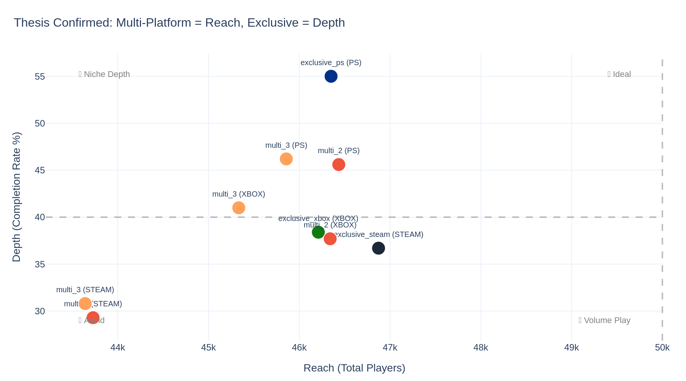

- **For reach:** Go multi-platform. Each additional platform adds ~46K players. Multi-platform games get 5× more reviews on Steam.
- **For depth:** Go PlayStation exclusive. PS players complete 55% of achievements vs 29–39% elsewhere. Exclusives outperform multi-platform on every platform.
- **The tradeoff is structural** — multi-platform dilutes per-player engagement while maximizing total audience.

## Key Findings

### The market is overwhelmingly single-platform

85.5% of games never leave their platform. Only 8.4% of titles appear on 2+ platforms.

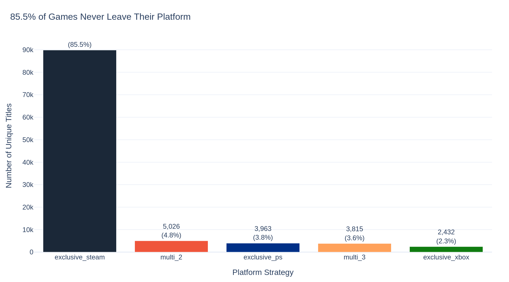

### Multi-platform games cost 3× more

Median $14.99 for multi-platform vs $4.99 for exclusive. PlayStation is the cheapest platform for the same game 64.5% of the time.

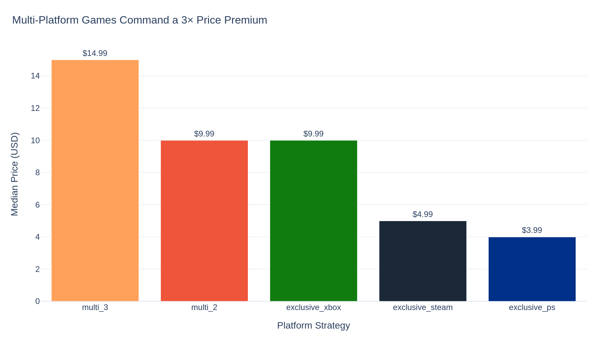
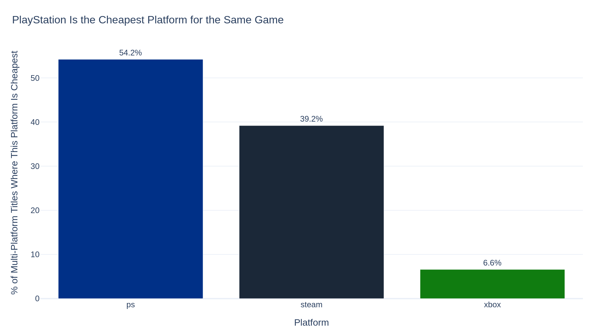

### Steam = breadth, PlayStation = depth

Steam players average 148.9 games owned. PS players go deeper — 1.69 achievements per game, the highest ratio.

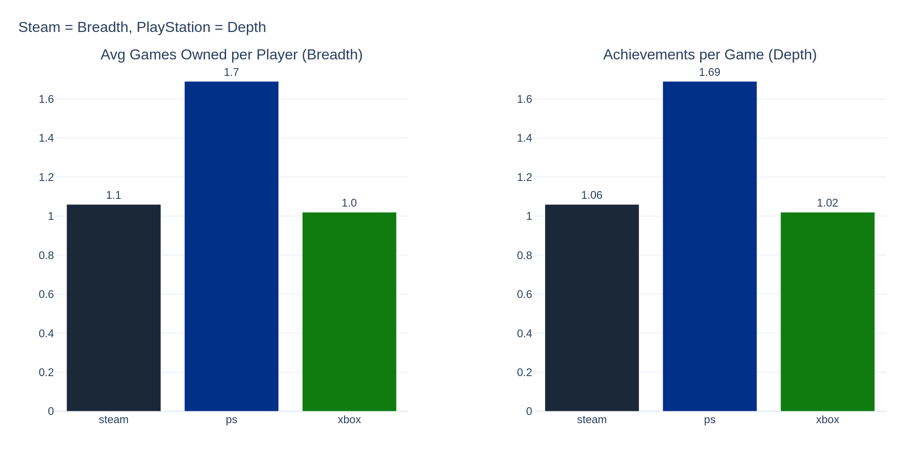

### Exclusives win on completion — every platform

PS exclusive games achieve 55.0% completion vs 29.3% for Steam multi-platform titles. The pattern holds across every platform×strategy combination.

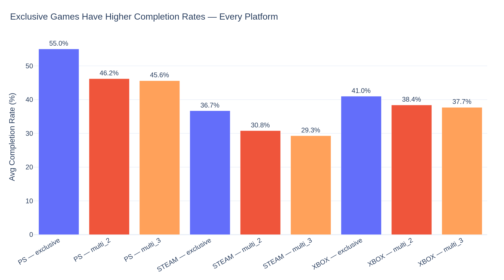

### COVID boosted everyone; Xbox is declining

The 2020 bump is visible across all platforms. Xbox has declined from 1.23M unlocks (2021) to 808K (2024).

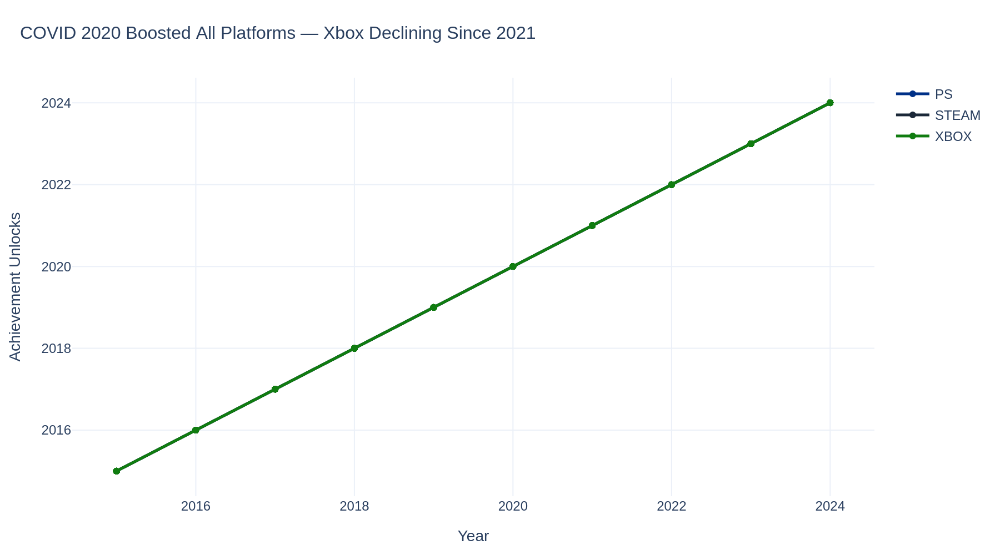

### Geography predicts how you play

Spain is 91% PlayStation. Russia flips to Steam majority. Small markets (Estonia, Hong Kong, Czechia) engage deepest — 8 of the top 10 are PlayStation.

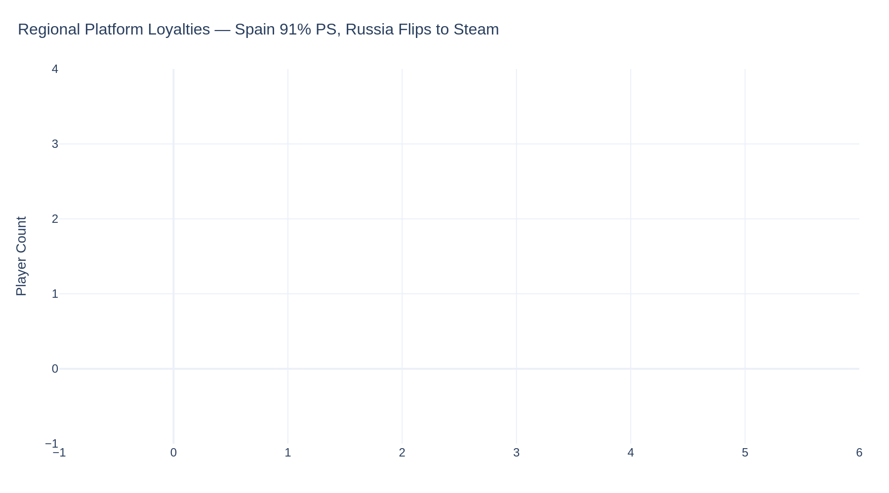
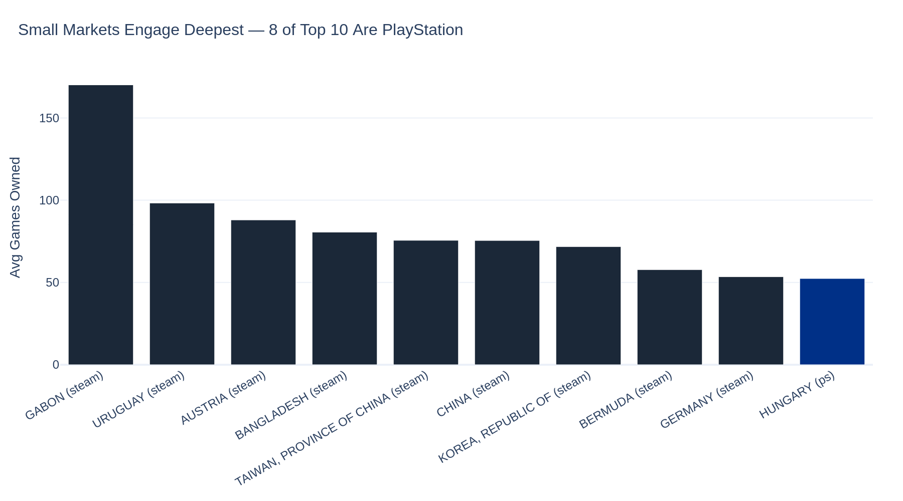

### Multi-platform games get 5× more reviews

83.9 reviews per game vs 17.4 for exclusives on Steam. Visibility begets visibility.

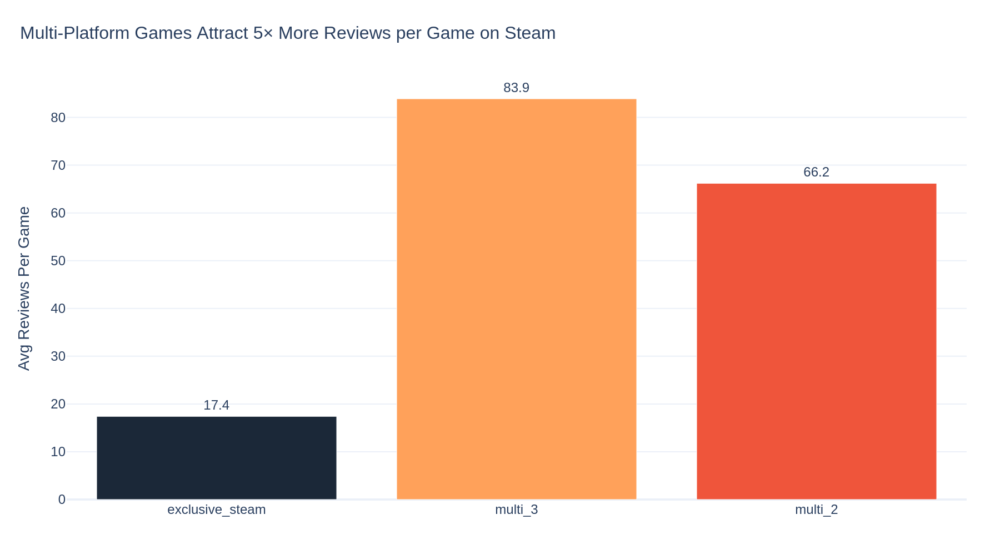

## Machine Learning Validation

Three models validated the patterns found in SQL:

**Random Forest + Logistic Regression** — predict whether a game goes multi-platform. All features (genre diversity, price, platform count) push toward multi-platform.

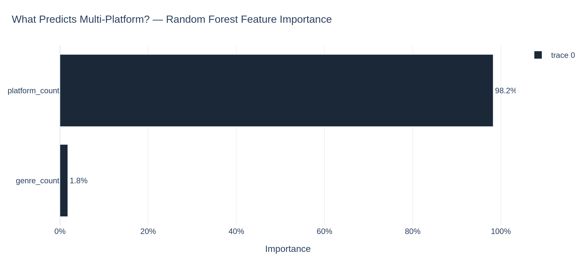
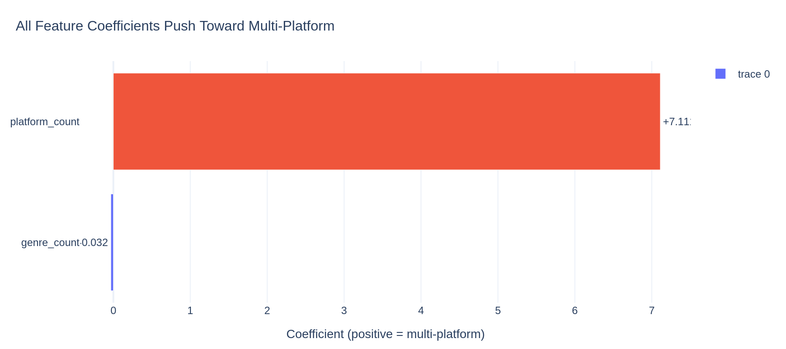

**K-Means Clustering** — finds natural game segments without labels. Clusters align with the exclusive-vs-multi divide, confirming the structure is real.

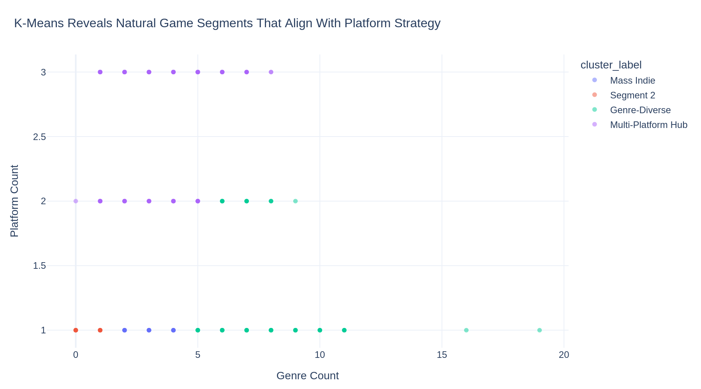

## Methodology

**Thesis-first analysis.** The research question, success proxies, and output schema were defined before any Gold queries were written ([methodology.md](docs/methodology.md)).

**Three success proxies** (no revenue data exists):

| Proxy | Lifecycle Phase | Source |
|-------|----------------|--------|
| Library presence | Acquisition | silver_purchased_games |
| Achievement completion | Retention | silver_history + silver_achievements |
| Review reception | Advocacy | silver_reviews (Steam only) |

**Pipeline:** 19 raw CSV tables → 13 Bronze tables → 7 Silver tables → 14 Gold tables → Python notebook

**Statistical rigor:** Welch's t-tests with Cohen's d (effect size) and 95% confidence intervals. With 100K+ observations, "significant" is easy — effect size is what matters.

## Tech Stack

- **BigQuery** — SQL pipeline (Bronze → Silver → Gold medallion architecture)
- **Python/Pandas** — data manipulation and feature engineering
- **Plotly** — interactive visualizations with consistent theming
- **scipy** — statistical hypothesis testing
- **scikit-learn** — Random Forest, Logistic Regression, K-Means

## Project Structure

```
gaming-platforms-synthesis/
├── README.md
├── sql/
│   ├── bronze/          # Raw → cleaned tables (13 new + 6 reused)
│   ├── silver/          # Platform-unified tables (7 tables, 90M+ rows)
│   └── gold/            # Analysis queries (Q00–Q07, 14 output tables)
├── notebooks/
│   └── gaming_platforms_synthesis.ipynb   # Full analysis notebook
├── charts/              # 15 exported PNG visualizations
├── docs/
│   ├── methodology.md   # Success framework + thesis
│   ├── cleaning_decisions.md
│   └── upload_mapping.md
└── presentation/        # Final presentation
```

## How to Reproduce

1. Download the [Gaming Profiles 2025](https://www.kaggle.com/datasets/artyomkruglov/gaming-profiles-2025-steam-playstation-xbox) dataset from Kaggle
2. Upload CSVs to BigQuery (`fast-archive-478610-v8` / `gaming_project`)
3. Run SQL scripts in order: `sql/bronze/` → `sql/silver/` → `sql/gold/`
4. Export Gold tables as CSV
5. Open `notebooks/gaming_platforms_synthesis.ipynb` in Google Colab
6. Mount Google Drive with CSVs and run all cells

## Known Limitations

- Reviews are **Steam-only** — advocacy proxy is asymmetric across platforms
- **No revenue data** — success is behavioral, not financial
- Cross-platform matching uses **title text** — no shared game ID exists
- Xbox has **no country field** — geographic analysis covers PS + Steam only
- **54.2% of Steam players** have NULL library data, excluded from analysis

## What I Learned

This project taught me the full analytical pipeline — from raw CSVs to a strategic recommendation backed by statistics and machine learning. Key lessons:

1. **Methodology before queries.** Defining the thesis before writing SQL prevents aimless exploration.
2. **Silent bugs are the dangerous ones.** A platform value mismatch produced zero errors and completely wrong results. Validation means checking what's *in* the data, not just how much.
3. **p-value alone is not enough.** With large samples, everything is "significant." Cohen's d answers the question that matters: *how big is the effect?*
4. **Professional notebook patterns** (config blocks, helper functions, finding-as-title charts) compound — they save hours and signal competence to reviewers.

## Dataset

**Source:** [Gaming Profiles 2025](https://www.kaggle.com/datasets/artyomkruglov/gaming-profiles-2025-steam-playstation-xbox) by Artyom Kruglov

131,884 games across Steam, PlayStation, and Xbox. 55M+ raw rows spanning games, players, achievements, purchase history, prices, and reviews.

---

*Built by Poi — Workintech Data Analyst Program — March 2026*
